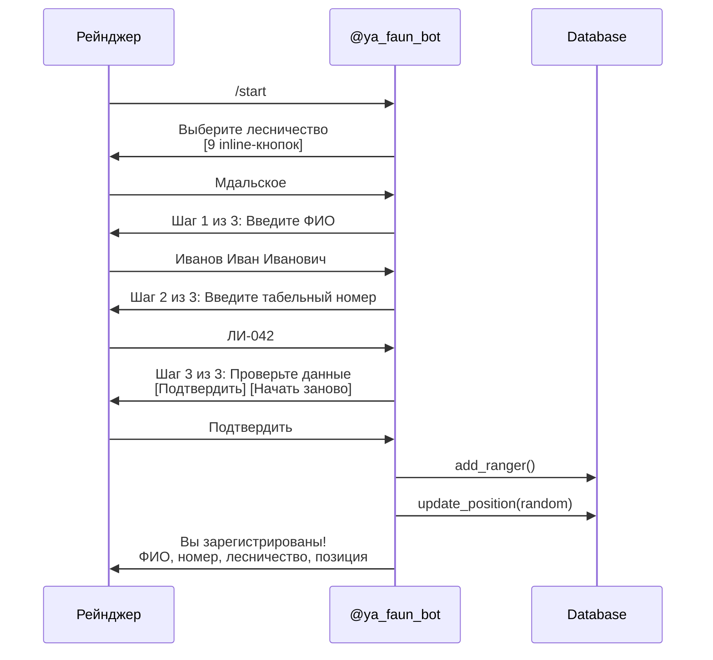

# Telegram-бот

Бот **@ya_faun_bot** — основной интерфейс взаимодействия с рейнджерами (лесными инспекторами).

## Команды

| Команда | Описание |
|---------|----------|
| `/start` | Регистрация нового рейнджера или приветствие |
| `/status` | Показать данные регистрации |
| `/stop` | Отключить оповещения (рейнджер остаётся в БД) |
| `/test` | Отправить тестовый алерт с рандомными координатами |
| `/help` | Справка по командам и порядку работы |
| `/cancel` | Отменить текущую регистрацию |
| `/rangers` | Список инспекторов (только для администраторов) |

Команды автоматически регистрируются через `set_my_commands` при старте бота.

---

## Mini App

Кнопка **"Карта"** в нижнем меню чата открывает веб-дашборд `https://faun-forrest.duckdns.org/` как Telegram Mini App. Настраивается через `set_chat_menu_button` в `post_init`.

---

## Регистрация



### Шаги регистрации

1. **Выбор лесничества** — 9 вариантов: зонтичное Варнавинское + 8 участковых (inline-кнопки)
2. **Ввод ФИО** — минимум 2 слова (фамилия + имя), шаг 1 из 3
3. **Ввод табельного номера** — непустая строка, шаг 2 из 3
4. **Подтверждение данных** — шаг 3 из 3, inline-кнопки "Подтвердить" / "Начать заново"
5. **Автоматическое назначение** — зона из `DISTRICTS`, рандомная позиция внутри зоны

TTL регистрации: **30 минут** (`_REG_TTL = 1800`). После — нужно начать заново.
Отменить регистрацию: `/cancel`.

---

## Лесничества (Districts)

| Slug | Название | Зона покрытия |
|------|---------|---------------|
| `varnavino` | Варнавинское лесничество | 57.05–57.55°N, 44.60–45.40°E |
| `mdalskoe` | Мдальское | 57.40–57.55°N, 44.60–44.80°E |
| `semyonborskoe` | Семёнборское | 57.35–57.50°N, 44.80–45.00°E |
| `poplyvinskoye` | Поплывинское | 57.30–57.45°N, 45.00–45.20°E |
| `kamennikoskoye` | Каменниковское | 57.20–57.35°N, 44.60–44.80°E |
| `varnavinskoye` | Варнавинское | 57.15–57.30°N, 44.80–45.00°E |
| `kolesnikovskoye` | Колесниковское | 57.10–57.25°N, 45.00–45.20°E |
| `kameshnoye` | Камешное | 57.05–57.20°N, 45.10–45.30°E |
| `kayskoye` | Кайское | 57.05–57.20°N, 45.20–45.40°E |

---

## Zone-based Routing

Алерты отправляются **только** рейнджерам, чья зона (bounding box) покрывает координаты инцидента:

```python
WHERE active = 1
  AND zone_lat_min <= lat AND zone_lat_max >= lat
  AND zone_lon_min <= lon AND zone_lon_max >= lon
```

Если ни один рейнджер не покрывает точку — алерт записывается в журнал, но **не отправляется**.

---

## Rate Limiting (Severity-Aware)

Cooldown между алертами одному рейнджеру зависит от уровня тревоги:

| Уровень | Cooldown | Описание |
|---------|----------|----------|
| `alert` | 60 сек (1 мин) | Критические угрозы |
| `verify` | 300 сек (5 мин) | Требуется проверка |
| `log` | 600 сек (10 мин) | Журнальная запись |

Env var (fallback): `ALERT_COOLDOWN_SECONDS` (по умолчанию 300).

---

## Quiet Hours

Некритические алерты (`verify`, `log`) подавляются в ночное время (МСК):

| Параметр | Значение | Env var |
|----------|----------|---------|
| Начало | 22:00 | `QUIET_HOURS_START` |
| Конец | 06:00 | `QUIET_HOURS_END` |

Критические алерты (`alert`) доставляются **всегда**.

---

## Spatial Deduplication

Перед созданием инцидента проверяется: есть ли уже pending/accepted инцидент в радиусе **500 м** за последние **5 мин**. Если есть — возвращается существующий инцидент, дубликат не создаётся.

---

## Snooze

Рейнджер может **отложить** алерт на 15 минут кнопкой "Отложить 15 мин". По истечении времени алерт отправляется повторно (если инцидент всё ещё в статусе `pending`).

---

## Incident Lifecycle

```mermaid
stateDiagram-v2
    [*] --> pending : Алерт отправлен

    state "pending" as p {
        note right: Кнопки: На карте,<br>Принять вызов,<br>Отложить 15 мин
    }

    p --> accepted : Принять вызов
    p --> false_alarm : Другой рейнджер принял
    p --> false_alarm : Автозакрытие (>30 мин)

    state "accepted" as a {
        note right: Нативная карта (send_location)<br>Ожидание геолокации
    }

    a --> on_site : Геолокация (<=1000м)
    a --> false_alarm : Отклонено
    a --> false_alarm : Автозакрытие (>60 мин)

    state "on_site" as o {
        note right: Кнопки:<br>Нарушение подтверждено<br>Ложный вызов
    }

    o --> resolved : Протокол PDF
    o --> false_alarm : Ложный вызов

    resolved --> [*]
    false_alarm --> [*]
```

### 1. Pending -> Accepted

Рейнджер нажимает **"Принять вызов"** (`accept:{incident_id}`).

- Проверка: status == `pending` (защита от concurrent accept)
- Обновление: `status=accepted`, `accepted_by_*`, `accepted_at`
- Другие рейнджеры: кнопки удаляются, текст заменяется на "Вызов принял: {name}"
- Рейнджеру: координаты + ссылка на Яндекс.Карты
- **Нативная карта**: `send_location()` с координатами инцидента
- Если есть drone photo — отправляется после accept

### 2. Accepted -> On_site

Рейнджер отправляет **геолокацию**.

- Проверка расстояния: `haversine(ranger, incident) <= 1000м` (или `is_demo=True`)
- Обновление: `status=on_site`, `arrived_at`, `response_time_min`
- Рейнджеру: кнопки "Нарушение подтверждено" / "Ложный вызов"

### 3. On_site -> Resolved

**Нарушение подтверждено** -> сбор доказательств:

1. **Фото** — рейнджер отправляет фото нарушения
2. **Описание** — текст или голосовое сообщение (STT через SpeechKit)
3. **Юридизация** — YandexGPT переписывает описание юридическим языком
4. **RAG** — правовые статьи через File Search
5. **PDF** — генерация протокола (fpdf2)
6. **Закрытие** — `status=resolved`, PDF отправлен

### 4. False Alarm

На любом этапе рейнджер может отметить инцидент как **ложный вызов**: `status=false_alarm`.

### 5. Auto-cleanup (Stale Incidents)

JobQueue проверяет каждые **5 минут**:
- `pending` > 30 мин -> автозакрытие (`false_alarm`)
- `accepted` > 60 мин -> автозакрытие (`false_alarm`)

---

## Admin

### Команда `/rangers`

Показывает список всех зарегистрированных инспекторов с табельными номерами и статусом.

Доступ контролируется env var `ADMIN_CHAT_IDS` (comma-separated Telegram chat IDs). Если переменная не задана — команда доступна всем.

---

## Audit Log

Все ключевые действия логируются в формате:

```
AUDIT chat_id=<id> action=<action> incident=<id> result=<result>
```

| Action | Описание |
|--------|----------|
| `accept` | Рейнджер принял вызов |
| `verdict:confirmed` | Нарушение подтверждено |
| `verdict:false` | Ложный вызов |
| `evidence_photo` | Фото доказательства |
| `evidence_voice` | Голосовое сообщение |
| `protocol_generated` | PDF-протокол создан |
| `snooze` | Алерт отложен на 15 мин |

---

## Callback-и

| Pattern | Handler | Описание |
|---------|---------|----------|
| `district:{slug}` | `district_chosen` | Выбор лесничества при регистрации |
| `accept:{incident_id}` | `accept_callback` | Принять вызов |
| `verdict:confirmed:{id}` | `verdict_callback` | Нарушение подтверждено |
| `verdict:false:{id}` | `verdict_callback` | Ложный вызов |
| `confirm_reg:yes/no` | `confirm_reg_callback` | Подтверждение регистрации |
| `snooze:{incident_id}` | `snooze_callback` | Отложить алерт на 15 мин |
| `rag:action:{class}:{lat}:{lon}` | `rag_callback` | RAG: рекомендации |
| `rag:protocol:{class}:{lat}:{lon}` | `rag_callback` | RAG: шаблон протокола |

---

## Message Handlers

| Тип | Handler | Контекст |
|-----|---------|----------|
| `PHOTO` | `handle_inspector_photo` | on_site -> сохранить как доказательство; иначе -> Vision |
| `VOICE` | `voice_handler` | on_site -> STT -> ranger_report_raw |
| `LOCATION` | `location_handler` | accepted -> проверка proximity (1000м) |
| `TEXT` | `text_handler` | Регистрация (ФИО/номер/подтверждение) или on_site -> ranger_report_raw |

---

## Error Handling

- **Global error handler** в обоих ботах (ranger + drone): логирует traceback, отправляет пользователю "Произошла ошибка"
- **Конкретные сообщения**: `voice_handler` различает `ConnectionError` (сервис недоступен) и прочие ошибки
- **Markdown fallback**: drone bot при ошибке парсинга Markdown отправляет plain text

---

## Формат алерта

```
*АЛЕРТ: Бензопила*
━━━━━━━━━━━━━━━━
Время: 14:32:15 МСК
Координаты: 57.3700 N, 44.6300 E
Уверенность: 85%
Уровень: ТРЕВОГА

Ближайший инспектор: Иванов И.И. (2.3 км)

Дрон вылетел для подтверждения

[На карте]  [Принять вызов]  [Отложить 15 мин]
```
